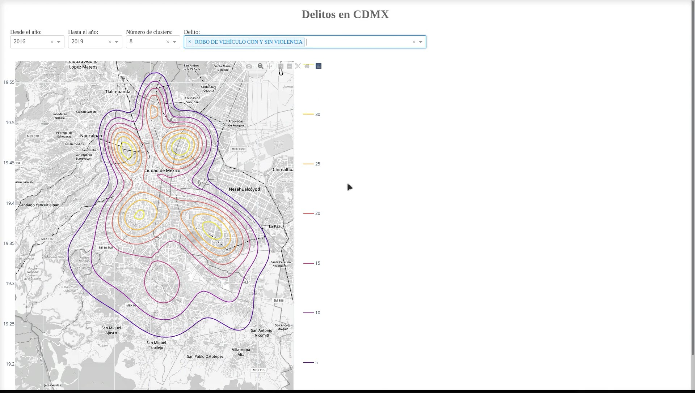

# Sistema web para la modelización del riesgo espacio-temporal de los patrones delictivos en la Ciudad de México
El sistema web desarrollado tiene como objetivo modelar el riesgo espacio-temporal de diferentes tipos de delitos en la Ciudad de México mediante el uso de datos abiertos. Para ello, se utiliza un enfoque basado en mezclas gaussianas, que permite estimar el riesgo relativo de ocurrencia de un delito en un lugar determinado, para diferentes periodos de tiempo específicos.

La exposición a la violencia y el delito puede causar estrés, ansiedad, depresión y otros problemas de salud mental, así como lesiones físicas. Además, la inseguridad puede limitar el acceso a servicios de atención médica y la capacidad de realizar actividades al aire libre, lo que puede afectar la salud de las personas.

La modelización del riesgo de delitos es un aspecto importante en la prevención y control del crimen, y la técnica de mezclas gaussianas ha demostrado ser útil para analizar patrones complejos de datos espaciales y temporales. En este sentido, el sistema web permite a los usuarios visualizar mapas de riesgos, para ser utilizados en posibles análisis de tendencias y comparaciones entre diferentes tipos de delitos y áreas geográficas.

En resumen, el sistema web utiliza la técnica de mezclas gaussianas para modelar el riesgo espacio-temporal de diferentes tipos de delitos en la Ciudad de México, lo que puede contribuir a la toma de decisiones informadas en materia de prevención y control del crimen en la ciudad. 

**Proyecto CONACyT**: Observatorio de datos para descubrimientos de patrones Sociales-EspacioTemporales en Salud, Movilidad y Calidad del Aire.

**Número**: 7051.

**Objetivo**: Definir las bases de interoperabilidad para  homologar  la información de las bases de datos de salud , y  obtener datos precisos y confiables, que permitan tener series históricas  y generar la trazabilidad de los pacientes, en especial de aquellos que padecen enfermedades crónicas no transmisibles, así como la construcción de indicadores de salud y su relación con la exposición a contaminantes atmosféricos. 

## Datos abiertos utilizados:
[Carpetas de investigación PGJ](https://datos.cdmx.gob.mx/dataset/carpetas-de-investigacion-pgj-cdmx)

## Uso
Ejecutar `python dash_delitos_cdmx.py`

## Requisitos
[Archivo requirements.txt](requirements.txt)

### Lista de archivos
[dash_delitos_cdmx.py](dash_delitos_cdmx.py]): Código Python para el sistema web de modelado de riesgo de delitos.

[delitos.sqlite](delitos.sqlite): Base de datos de delitos en formato SQLite.

[cdmx2.png](cdmx2.png): Mapa de la CDMX para la proyección de las curvas de riesgo.	

[dash_delitos.mp4](dash_delitos.mp4): Vídeo del funcionamiento del sistema web.

[dash.jpg](dash.jpg): Captura de pantalla del sistema web funcionando.
